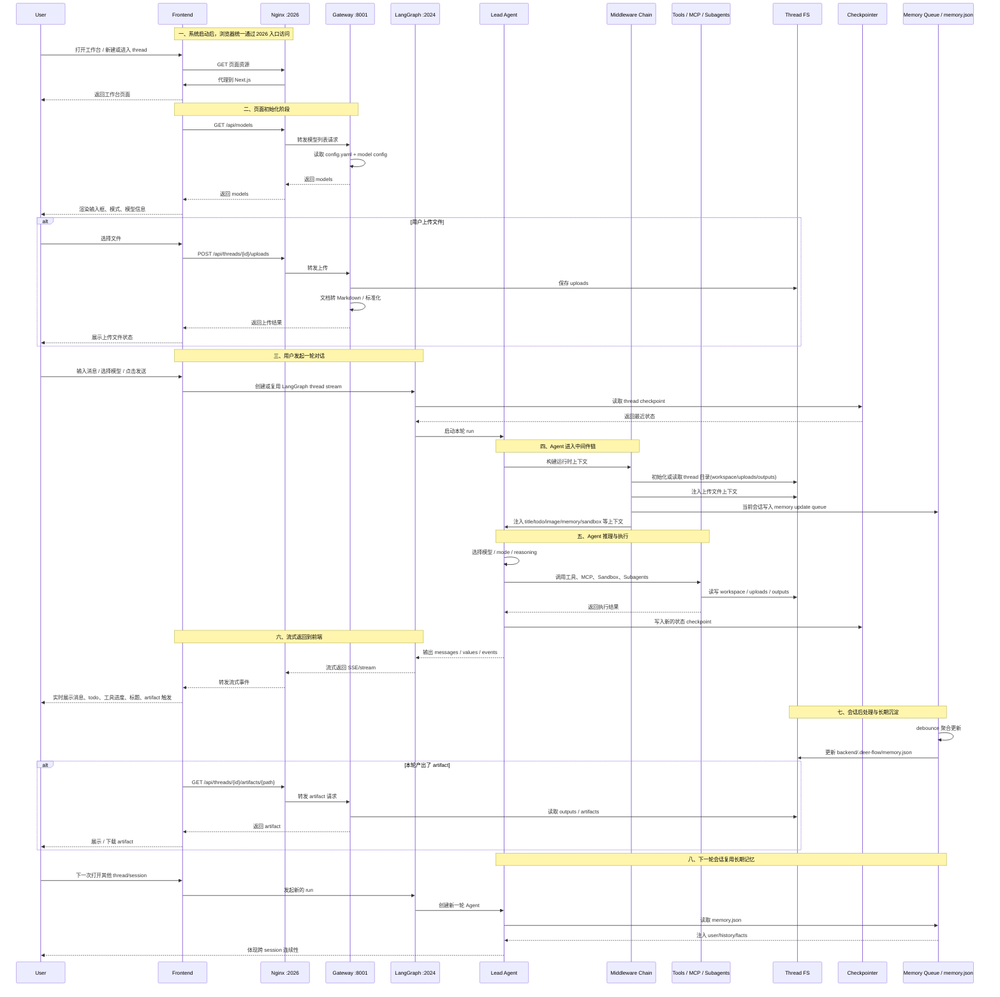
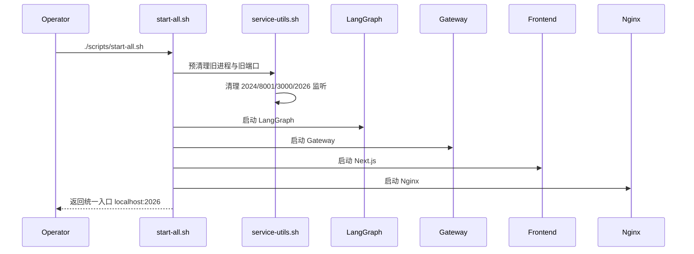
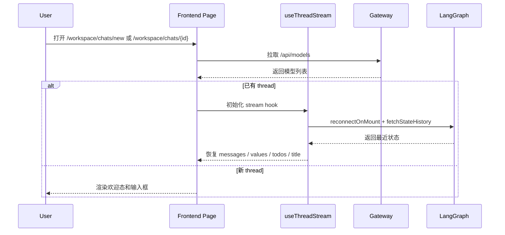
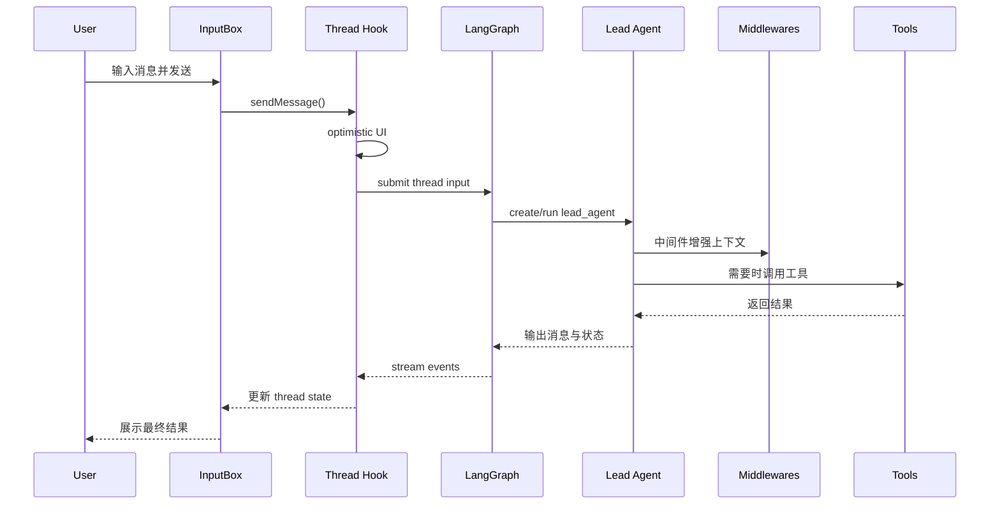
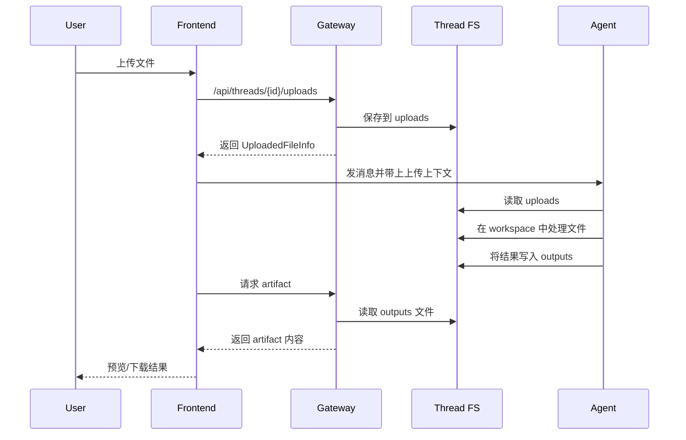
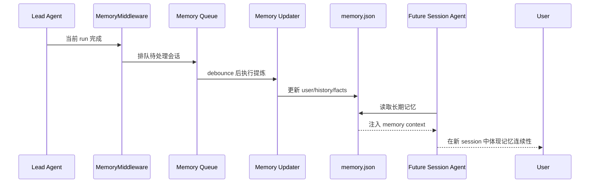
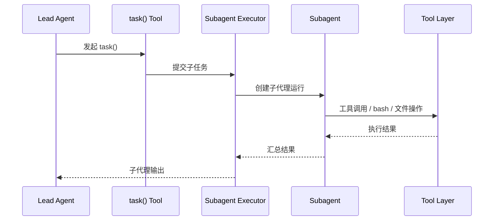
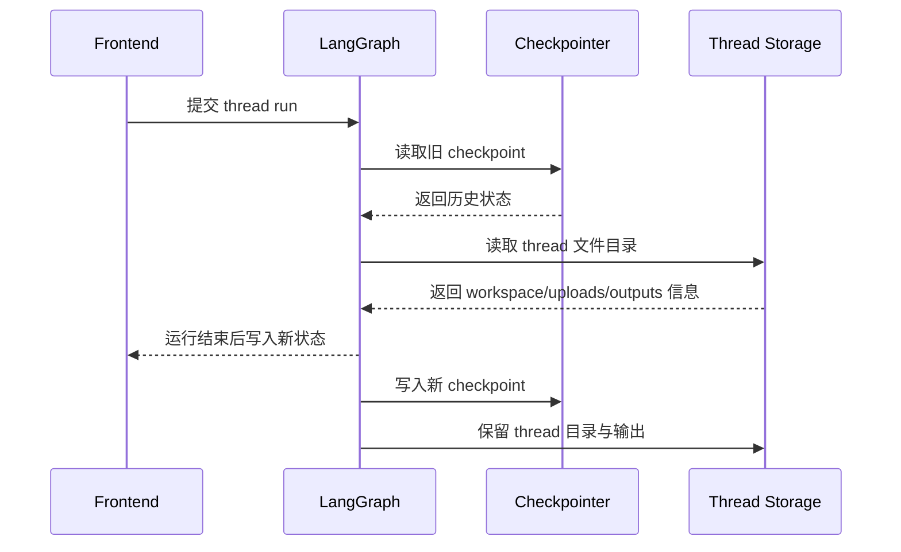
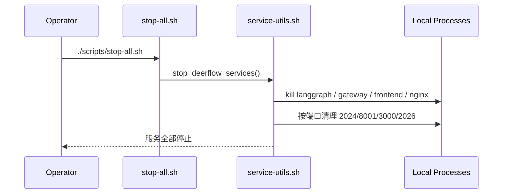

# DeerFlow 完整流程闭环时序图

## 1. 说明

这一篇不是只列局部流程，而是从“服务启动 -> 页面初始化 -> 模型加载 -> 消息提交 -> Agent 运行 -> 工具/文件/子代理 -> 记忆沉淀 -> 结果展示 -> 下次会话复用”的完整闭环来描述 DeerFlow 当前项目。

系统中的关键参与者：

- 用户 / 浏览器
- Next.js Frontend
- Nginx 统一入口
- Gateway API
- LangGraph Runtime
- Lead Agent
- Middleware Chain
- Tools / Sandbox / MCP / Subagents
- Thread 文件系统
- Checkpointer
- Memory Queue / memory.json

## 2. 项目完整闭环主时序图

## 3. 服务启动闭环时序图

## 4. 页面初始化闭环时序图

## 5. 单轮对话主链路时序图

## 6. 上传、工作区与产物闭环时序图

## 7. 记忆闭环时序图

## 8. 子代理闭环时序图

## 9. 状态持久化闭环

## 10. 关闭服务闭环

## 11. 当前闭环中的关键设计判断

### 11.1 DeerFlow 不是单链路系统，而是多闭环平台

至少包含：

- 页面初始化闭环
- 单轮对话闭环
- 文件处理闭环
- 长期记忆闭环
- 状态持久化闭环

### 11.2 Gateway 与 LangGraph 的职责是刻意分开的

- Gateway 管配置、资源和辅助接口
- LangGraph 管真正的 Agent 运行时

这意味着二开时不要轻易把两层揉在一起。

### 11.3 真正最脆弱的是“运行治理层”

从这次排查来看，最容易出问题的不是业务逻辑，而是：

1. 旧进程残留
2. 端口占用
3. 配置加载路径
4. 前端同源地址策略
5. Nginx 到后端的代理行为

因此 DeerFlow 二开的第一优先级，不应该是继续加功能，而应该是把运行闭环治理完整。
